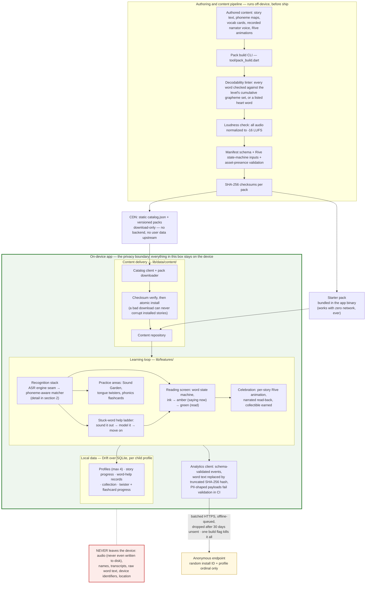
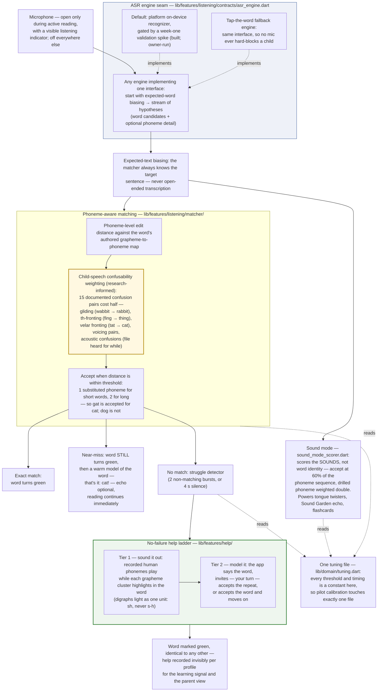

# LearnToRead — System Architecture

*Prepared for investor review. Every component named below exists in this repository today, with tests.*

LearnToRead is a Flutter app (iOS + Android) that teaches children ages 5–10 to read using structured phonics. The child reads a story aloud; the app listens and turns each word from ink to green as it is read, steps in with a graduated phonics scaffold when the child gets stuck, and rewards every finished story with a hand-authored animation of the scene the child just read. All content — story text, per-word phoneme maps, recorded human voice, animations — is authored offline, machine-validated, and shipped as versioned story packs. The app runs fully offline from first launch, keeps every piece of child data on the device, and sends only anonymous, hash-scrubbed telemetry. The engineering premise throughout: a child is never told they are wrong, and the system is built so it cannot accidentally do so.

---

## 1. System architecture

Three layers: a content pipeline that refuses to ship a bad story, an on-device app that owns the entire learning loop, and a hard privacy boundary with exactly one narrow, anonymous crossing.

Load-bearing properties of this layer cake:

- **The pipeline is the quality gate, not a convention.** A story whose words exceed its phonics level, whose audio misses the loudness target, whose animation lacks the required state-machine inputs, or whose manifest fails schema **cannot be built into a pack** (`lib/pipeline/` — `decodability_linter.dart`, `loudness_check.dart`, `manifest_validator.dart`, `rive_input_validator.dart`, `asset_presence_check.dart`). Content errors are caught at build time on the author's machine, never at runtime on a child's device.
- **Offline-first is structural.** The starter pack ships in the binary; an integration test installs the app in airplane mode and runs the full experience. CDN packs are static files verified by checksum and installed atomically — there is no server that can be down.
- **The privacy boundary is enforced in code and CI.** Audio buffers are never written to storage (checked by test). The analytics schema rejects PII-shaped fields in CI; word identity crosses the boundary only as a truncated SHA-256 hash. There are no accounts, no third-party SDKs, and a single build flag produces a zero-telemetry binary.

## 2. The recognition stack

This is the hardest problem in the product and the deepest engineering. Off-the-shelf speech recognition is documented to fail on young children — rendering a 4-year-old's "looking at the frog" as "recognize the fog." The stack is designed around a different question: not *"what did the child say?"* but *"is this a fair attempt at the word we know comes next?"*

What makes this stack unusual:

- **Acceptance widens exactly where children's speech actually varies, and nowhere else.** The confusability table in `phoneme_distance.dart` encodes documented child-speech error axes — a child who says "wabbit" is credited with reading *rabbit*, because R→W gliding is developmental, not a reading error. A clearly wrong word still doesn't pass. The design follows the expected-text hybrid approach from current children's-ASR research (KidSpeak): the recognizer is biased with the known target, and our matcher — not the engine — decides acceptance.
- **There is no failure state, by construction.** The reading screen contains no red, no error sounds, no "wrong" (verified by test). Imperfect reading routes to patience and help; the maximum time a child can be stuck before the story advances is bounded and tested. Helped words render identically to correct words — the finished sentence is purely triumphant, while help is logged privately for the learning signal.
- **The engine is a commodity behind the seam; the pedagogy is ours.** `AsrEngine` is one small interface (biased start, hypothesis stream, stop). The platform recognizer, a future phonetically-informed cloud model, and the tap fallback all sit behind it identically — the matcher, help ladder, and every test above the seam are engine-independent.
- **Sound mode turns the same stack into phonics practice.** Scoring phoneme sequences instead of word identity powers three additional practice surfaces (tongue twisters, the Sound Garden grapheme cards, spaced-repetition flashcards) from the same matcher and the same recorded 44-phoneme human voice set.

## 3. Why this is hard to copy

- **Test-first construction with frozen contracts.** The repo's build manifest records 25 units each planned, written red (failing tests first), then verified — 127 test files, ~1,700 tests. The tracker event stream, ASR seam, and word-state machine are pinned contracts: UI, matcher, and engine evolve independently without breaking each other.
- **Phoneme-level pedagogy lives in the data model, not in prompts or heuristics.** Every shipped word carries an authored grapheme-to-phoneme map that simultaneously drives matching tolerance, sound-out highlighting, decodability linting, and flashcard generation. Replicating the app's surface without this substrate reproduces none of its behavior.
- **The child-speech acceptance model is research-informed and empirically tunable.** The confusability-weighted distance metric plus the single tuning file mean pilot findings become one-line calibrations — a competitor gluing a stock speech API to a word list has no equivalent adjustment surface.
- **The engine seam de-risks the fastest-moving dependency.** Children's ASR is improving rapidly; the interface (word + phone hypotheses, contextual biasing) is shaped for the next generation of phonetically-informed engines. Swapping engines is an adapter, not a rewrite — and the engine decision is gated by a purpose-built validation spike that ships in this repo (awaiting its device run) rather than assumed.
- **COPPA compliance is architectural, not a policy document.** No accounts, no audio retention (tested), on-device-only child data, per-profile mic consent behind a parental gate, and analytics that structurally cannot carry PII. There is no server-side child data because there is no server-side user data at all.
- **The content pipeline makes the library compoundable.** Machine-enforced decodability, loudness, schema, and animation-contract checks mean each new story is a validated data drop — no app release, no engineering time — while per-story cost tracking keeps library growth economics visible from story one.

---

*Primary sources in this repository: `PRD.md` (ratified spec), `lib/features/listening/` (recognition stack), `lib/features/help/` (help ladder), `lib/pipeline/` + `tool/pack_build.dart` (content pipeline), `lib/data/` (local storage and pack delivery), `lib/features/analytics/` (anonymous telemetry), `docs/` (per-unit behavior contracts), `manifest.jsonl` (test-first build record).*
