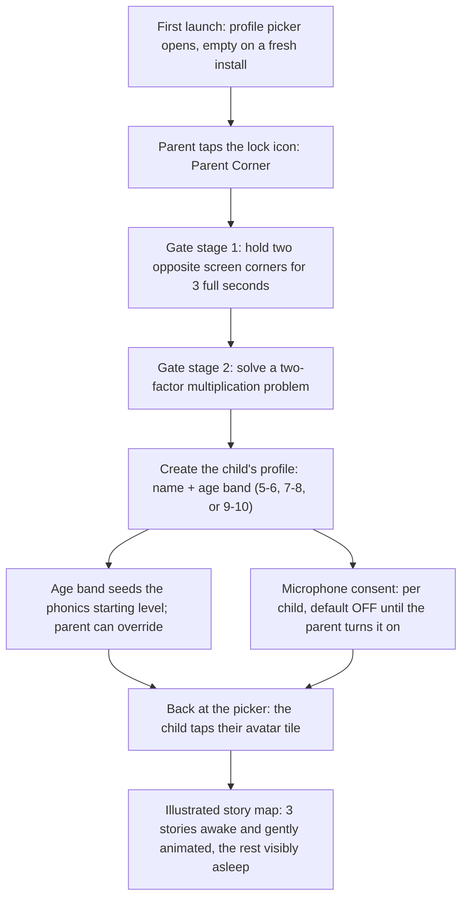
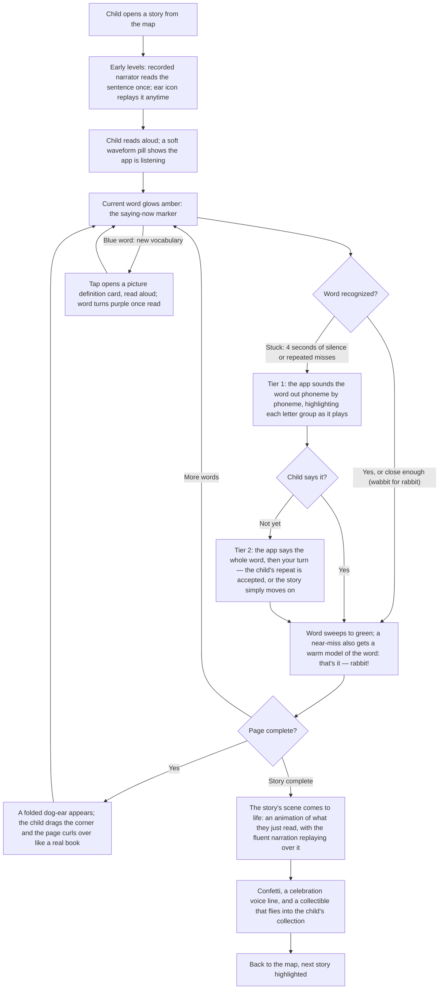
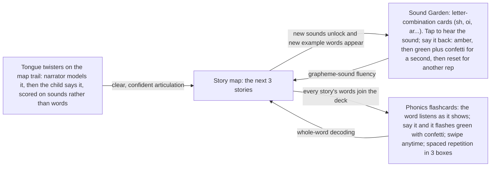

# The Student Journey

**How a family starts, and how a child gets to confident phonics reading.**

LearnToRead is a Flutter app for ages 5–10 built around one idea: the child
reads aloud, the app listens, and the text itself responds. Words change color
as they are read. Finishing a story makes its scene come to life. Every step
below is implemented in this repository; file references are included so each
claim can be checked against the code.

---

## 1. The guided start

There is no sign-up. No account, no email, no password — a profile is a row in
a local database, and nothing about the child ever leaves the device.

The moments that matter:

- **The gate is child-proof by design, not by obscurity.** A child cannot
  stumble through it: random taps, drags, and multi-touch mashing never
  satisfy the two-opposite-corners hold (the automated test suite fuzzes it
  with 100+ random inputs), and the multiplication challenge regenerates on
  every wrong answer. Leaving the corner re-locks it completely — there is no
  "stay unlocked" state (`lib/features/parent/parental_gate.dart`).
- **Age band places the child on the phonics continuum.** Ages 5–6 start at
  level 1 (single sentences), 7–8 at the first multi-sentence level, 9–10 at
  the first paragraph level (`lib/domain/phonics/placement.dart`). Placement
  is a starting decision only; later edits to the profile never move a child
  who has begun reading.
- **Consent is explicit and conservative.** The microphone toggle is off by
  construction; with it off, the OS permission is never even requested and
  the app runs in tap-to-advance mode. No audio is ever recorded or stored,
  in any mode.
- **The child navigates without reading.** Every profile gets a deterministic
  avatar (rocket, flower, star...) so "I'm the rocket" works on every launch;
  all navigation is icons plus recorded voice prompts, zero UI text to decode.
- **Three stories, always.** The map offers a rolling window of the next
  three uncompleted stories in phonics order — the child picks freely,
  finishing one wakes the next. A property test guarantees no reachable state
  where a child has nothing to read (`lib/domain/phonics/phonics_engine.dart`).

---

## 2. The reading loop

The core session. The child's own voice is the controller, and the text is
the interface.

What makes this loop teach:

- **"Wabbit" counts, deliberately.** The recognizer always knows the target
  sentence; acceptance is phoneme-level closeness against each word's
  authored sound map, widened along documented child-speech confusion axes —
  gliding (r becomes w), th-fronting, velar fronting, voicing pairs — at
  half cost (`lib/features/listening/matcher/phoneme_distance.dart`). A
  five-year-old's articulation never fails their reading. Near-misses still
  turn green; the app just warmly models the adult pronunciation, echo
  optional, and reading continues immediately.
- **There is no "wrong."** No red, no error sound, no failure state exists
  anywhere in the child-facing app — the test suite greps for it. The only
  responses to imperfect reading are patience (the listening pill switches
  to "Still listening — take your time") and the help ladder above. Help is
  invisible in the finished sentence: a helped word is as green as any other.
- **The sound-out is real phonics.** Tier 1 plays recorded human phonemes
  ("kuh... aah... tuh") while highlighting the matching letter groups from
  the word's grapheme-phoneme map — digraphs like "sh" light up as one unit,
  never as two letters (`lib/features/help/sound_out_sequence.dart`).
- **The child is never blocked.** After both tiers the word is accepted and
  the story moves on; a discreet tap-the-word fallback exists for every word,
  so a mic failure or a hard day never ends a session.
- **The page turn is the reward beat.** The machine holds at page
  completion; the child's own curl gesture — a physical book habit,
  deliberately — is what advances the story (`lib/design/page_curl.dart`).
- **The payoff stitches decoding into meaning.** The animation stage the
  child has been reading beside transforms into the scene they just decoded,
  while the fluent narration replays their words back — comprehension as the
  finale, not a quiz.

---

## 3. The practice orbit

Three light practice spaces circle the stories. None has a failure state;
all feed decoding skill back into the next story.

The garden shows every sound card from day one — ahead-of-level cards are
visibly asleep but still tappable, so curiosity is never fenced. Example
words on each card appear only once the child's level can decode them, and
turning to the next card never requires success: these are practice loops,
not gates (`lib/features/sound_garden/`, `lib/features/flashcards/`,
`lib/features/twister/`).

---

## 4. The invisible engine

The child sees stories, colors, and confetti. Underneath, the app keeps a
quiet ledger:

- **Per-word help records.** Every word carries an encounter count, a help
  count, and the deepest help tier reached (none / sound-out / modeled) —
  written silently whenever the ladder fires
  (`lib/features/help/help_recorder.dart`). Repeated encounters of the same
  word are the learning signal: does needing help decline?
- **Struggle and frustration signals.** The tracker distinguishes clean
  reads, near-miss acceptances, and helped words, and notes when a session
  ends mid-story shortly after a help event — the tuning file's timings
  exist to be adjusted from exactly this data.
- **Level advancement.** A child's level advances only when a level's full
  story set is complete; advancing unlocks vocabulary words, new twisters,
  and wakes new Sound Garden cards. The child never sees a score, a streak
  counter, or a percentage — progress is a filling collection scene and a
  trail of finished stories.
- **The parent's view lives behind the gate.** One plain screen per child:
  stories completed and the specific words that needed help, with the tier —
  concrete enough for "she got stuck on 'elephant'", deliberately without
  charts or comparisons. Analytics beyond the device are anonymous by
  schema: a random install ID, hashed words, never names, audio, or
  transcripts — and the schema test fails CI if anything PII-shaped appears.

---

## 5. Why phonics, why this works

This product commits to the settled science of reading — children learn to
read by mapping letters to sounds — and then enforces it in tooling rather
than trusting it to authors. The scope and sequence is a single ordered
progression (short vowels, digraphs, blends, silent-e, vowel teams,
r-controlled, multisyllable) stored as data, and a build-time decodability
linter rejects any story containing a word the child's level has not yet
been taught to decode, unless it is an explicitly taught "heart word"
(`lib/pipeline/decodability_linter.dart`). That guarantee is what makes the
loop honest: every story a child opens is one they can sound out with the
graphemes they own, so the amber-to-green moment is genuine decoding, not
guessing. Around that guarantee, every design choice serves one feedback
cycle — decode, hear yourself succeed, see the words become a living scene —
repeated with just enough new sound knowledge each level to keep the child
at the edge of their ability and never past it. The app's job is to make
that cycle feel like being read to by a book that listens back.
